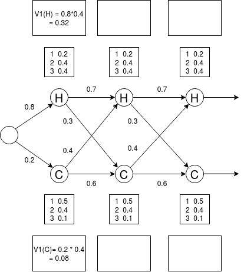

*ANLP 2020/21; Uni Potsdam; D. Schlangen, B. Aktas*

# Work Sheet for Week 07: POS Tagging

### Exercises
**[E1]** Find one tagging error in each of the following sentences that are tagged with the Penn Treebank tagset:

1. I/PRP need/VBP a/DT flight/NN from/IN Atlanta/NN
2. Does/VBZ this/DT flight/NN serve/VB dinner/NNS
3. I/PRP have/VB a/DT friend/NN living/VBG in/IN Denver/NNP
4. Can/VBP you/PRP list/VB the/DT nonstop/JJ afternoon/NN flights/NNS

**[E2]** Use the Penn Treebank tagset to tag each word in the following sentences from Damon Runyon's short stories. You may ignore punctuation. Compare your tags with your peers' answer. On which words did you disagree the most? Why?

1. It is a nice night.
2. This crap game is over a garage in Fifty-second Street...
3. ... Nobody ever takes the newspapers she sells ...
4. He is a tall, skinny guy with a long, sad, mean-looking kisser, and a mournful voice.
5. ... I am sitting in Mindy's restaurant putting on the gefillte fish, which is a dish I am very fond of, ...
6. When a guy and a doll get to taking peeks back and forth at each other, why there you are indeed.

**[E3]** Implement the "most likely tag" baseline. You can use the news category in Brown corpus with Universal tagset, accessible through NLTK. Compute for each word the tag that maximizes p(tag|word). Afterwards, test your implementation on the adventure category. You can assume all unknown words are Noun. Compute your error rate on known and unknown words. Is there additional rules you can create to handle unknown words better?

**[E4]** Now, we will practice the Viterbi algorithm to find the optimal state (tag) sequence given the sequence of observations (words). However, we will use [Eisner's Ice Cream](https://www.cs.jhu.edu/~jason/465/PowerPoint/lect24-hmm.xls) as example instead of sentence. The state now represents weather on a given day (hot & cold) and the observation represents number of ice cream Jason eats that day. Given that Jason Eisner ate 2 ice creams on day 1, 1 ice cream on day 2, 3 ice creams on day 3, what is the weather for those 3 days? 

Additional information is provided as the follows:

* States = Hot & Cold
* Initial Probability = Cold: 0.2, Hot: 0.8
* Transition Probability = Cold -> Cold : 0.6, Cold-> Hot: 0.4, Hot->Cold: 0.3, Hot -> Hot: 0.7
* Emission Probability (Cold) = 1 ice cream: 0.5, 2 ice creams: 0.4, 3 ice creams: 0.1
* Emission Probability (Hot) = 1 ice cream: 0.2, 2 ice creams: 0.4, 3 ice creams: 0.4

The visual representation of the problem is shown below. Please fill the missing parts in the image.

**[E5]** You have learned about logistic regression, which accepts arbitrary number of features as input and assign a class to a single observation. However, it does not work for sequence problem as it is not a sequence model. Can you think of a possible way to modify it into a sequence model? 

**[E6]** In highly inflectional languages, grammatical information such as case, number, gender and person are encoded in the words. 
Below are some examples from Turkish:

1. Yerdeki **izin** temizlenmesi gerek. (iz + Noun+A3sg+Pnon+Gen)

   The **trace** on the floor should be cleaned.
  
2. Uzerinde parmak **izin** kalmis¸ (iz + Noun+A3sg+P2sg+Nom)

   Your finger **print** is left on (it).
   
How would you implement a PoS tagger for this kind of languages (in order to not lose the encoded grammatical information on the words)? Decribe the steps to implement the tagger you suggest.

